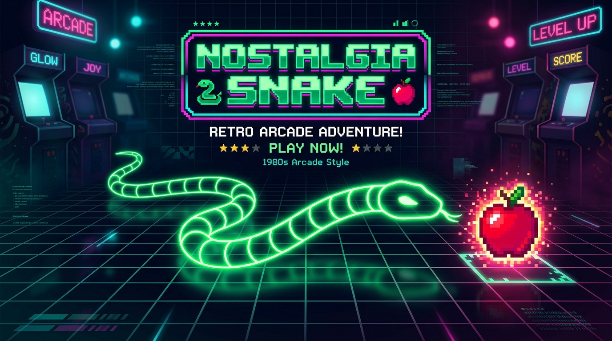
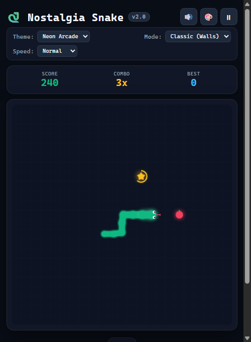
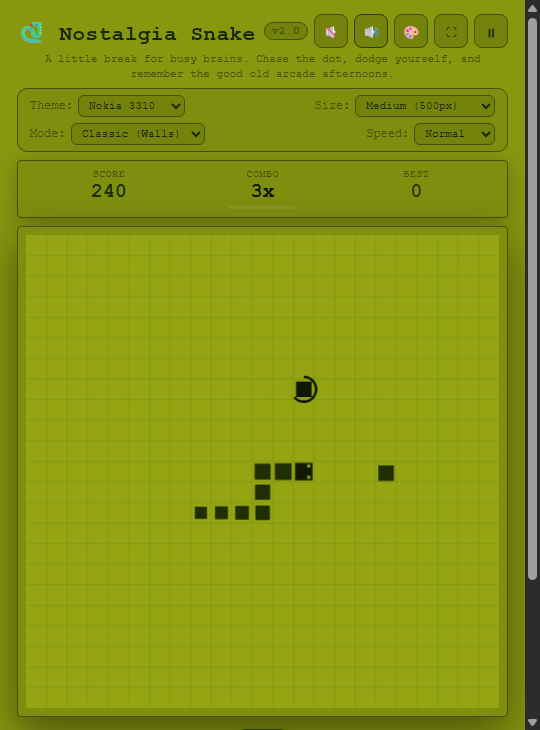
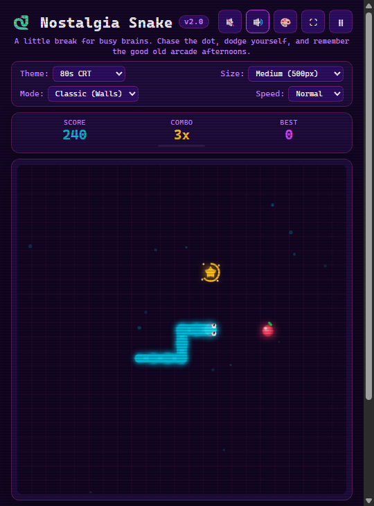

# 🐍 Nostalgia Snake (v2.0)

<p align="center">
  
</p>

<p align="center">
  
  
  
  
  
</p>

A polished, self-contained modern retro Snake arcade game you can play directly in your browser — zero installs, zero accounts, no build tools, and 100% offline.

> **Need a breather?** Chase the dot, dodge yourself, and let the old-school arcade buzz melt the day away. Built for coffee breaks, nostalgia trips, and simple arcade joy.

---

## ⚡ Instant Download & Play (Zero Setup)

### 📥 1-Click Download Options:
- 🟢 **[Download `index.html` (Standalone Single File)](https://raw.githubusercontent.com/Mohamed-Syed/nostalgia-snake/main/index.html)** *(Right-click → "Save link as...")*
- 📦 **[Download Full Repository (.ZIP)](https://github.com/Mohamed-Syed/nostalgia-snake/archive/refs/heads/main.zip)**

### 🕹️ How to Run:
1. **Download:** Save [`index.html`](https://raw.githubusercontent.com/Mohamed-Syed/nostalgia-snake/main/index.html) anywhere on your machine (e.g., Desktop or Downloads).
2. **Launch:** Double-click `index.html`. It opens directly in your default web browser (Chrome, Edge, Brave, Safari, Firefox).
3. **Play:** Start steering with Arrow keys or `WASD` immediately! No internet connection, server, or build step needed.

#### 💻 One-Line Terminal Command:
**Windows (PowerShell):**
```powershell
curl.exe -LO https://raw.githubusercontent.com/Mohamed-Syed/nostalgia-snake/main/index.html; start index.html
```

**macOS / Linux:**
```bash
curl -sLO https://raw.githubusercontent.com/Mohamed-Syed/nostalgia-snake/main/index.html && open index.html
```

---

## 🆕 What's New in v2.0

| Feature | Description |
| :--- | :--- |
| 🚀 **Silky 60+ FPS Movement** | Decoupled simulation ticks and sub-cell interpolation glide the snake continuously instead of choppy block hopping. |
| 🎮 **2-Step Input Queue** | High-precision cornering buffer prevents missed turns and completely blocks accidental 180° self-collisions. |
| 🎨 **4 Selectable Themes** | Switch instantly between **Neon Arcade**, authentic **Nokia 3310 LCD**, **80s CRT Synthwave**, and **Midnight Minimal**. |
| 🔊 **Procedural Web Audio** | Pure synthesized 8-bit retro sound effects (eat chimes, bonus fanfare, crash buzz) with 0 external sound files. |
| ⭐ **Dynamic Bonus & Combos** | Timed **Golden Star Bonus** with radial countdown timer ring, plus up to **5x combo multipliers** for fast eating. |
| 👀 **Expressive Snake Aesthetics** | Animated eyes that look toward your travel direction and glance at food, subtle tongue flicking, and organic body tapering. |
| 📱 **Mobile D-Pad & Haptics** | Touch swipe gestures + on-screen virtual tactile D-Pad and haptic vibration feedback on phones and tablets. |
| 🔄 **Modes & Difficulty** | Choose between **Classic (Walls)** or **Wrap-Around (Portal)**, across **Relaxed**, **Normal**, and **Turbo** speeds. |
| 🧪 **Automated Test Suite** | 14/14 automated unit tests verifying core game physics, turn queueing, and scoring logic. |

---

## 📸 Theme Showcase

<p align="center">
  
  
  
</p>

<p align="center">
  <i><b>Neon Cyber Arcade</b> • <b>Nokia 3310 LCD Dot-Matrix</b> • <b>80s Synthwave CRT</b></i>
</p>

---

## ▶️ How to Play

1. **Open `index.html`** in any modern web browser (double-click it or drag it into any tab).
2. **Steer:**
   - **Keyboard:** Arrow keys, `WASD`, or `HJKL` (Vim keys).
   - **Mobile / Touch:** Swipe anywhere on the board or tap the on-screen **Virtual D-Pad**.
3. **Controls & Shortcuts:**
   - <kbd>Space</kbd> / <kbd>P</kbd>: Pause & Resume.
   - <kbd>R</kbd>: Quick Restart.
   - <kbd>M</kbd>: Mute / Unmute audio.
   - <kbd>T</kbd>: Cycle visual theme.
4. **Food & Scoring:**
   - **Red Apple / Orb:** Standard food (+10 pts × combo multiplier).
   - **Golden Star / Bonus:** Timed bonus item spawning every 5 food items (+50 pts × combo).
   - **Combo Multipliers:** Eat quickly within 4.5 seconds to build combo streaks up to **5x**!
5. **Run Summary:** Review your final score, high score record alert, food eaten, survival time, and maximum length.

---

## 🛠️ Run & Verify

- **Simplest:** Double-click or open `index.html` in your browser.
- **Local Server (optional):**
  ```bash
  python3 -m http.server 8000
  # or
  npx serve .
  ```
- **Run Automated Logic Tests:**
  ```bash
  node test_snake.js
  ```
  ```text
  Running Nostalgia Snake logic tests...
    ✓ Snake is alive on reset
    ✓ Score is 0 on reset
    ✓ Snake initial length is 3
    ✓ Initial direction is right
    ✓ Snake stepped right
    ✓ Length remained constant while moving
    ✓ 180-degree reversal is blocked
    ✓ Snake turned down
    ✓ Snake grew after eating food
    ✓ Score increased after eating food
    ✓ Snake died hitting wall in Classic mode
    ✓ Snake alive after crossing boundary in Wrap mode
    ✓ Snake wrapped around to x=0
    ✓ Snake died on self-collision

  Test results: 14 passed, 0 failed
  ```

---

## 📜 License

MIT — feel free to fork, customize colors, or make it yours!
